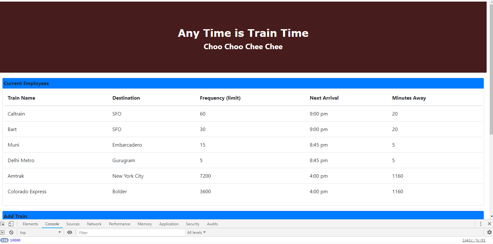
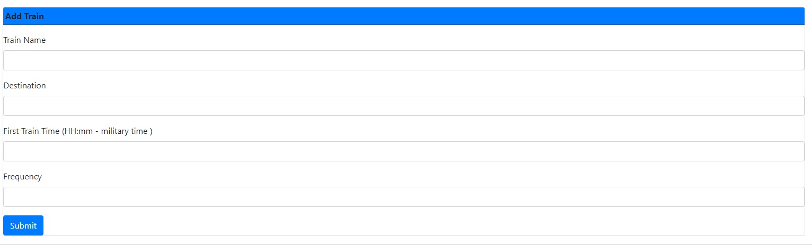

# trainTime

## What is Train Time Schedule

*  Train Time allows user to enter and get train schedules 
    
    * The schedule is based on the frequency of trains in minutes. For Example a user may enter a frequency of 30 minutes or any number

    * Based on the frequency and the train's first Trip of the day the user is presented the solution so they can see when the next train will arrive 

    * The user will also see the  in minutes for the next train.

    * The view auto refreshes for the user and presents updates every minute as the clock 

###Train Schedule top of Form

### Train Schedule Input part of Form at bottom

## The site was built using 

* HTML
* CSS
* Javascript
* jQuery
* Firebase.
